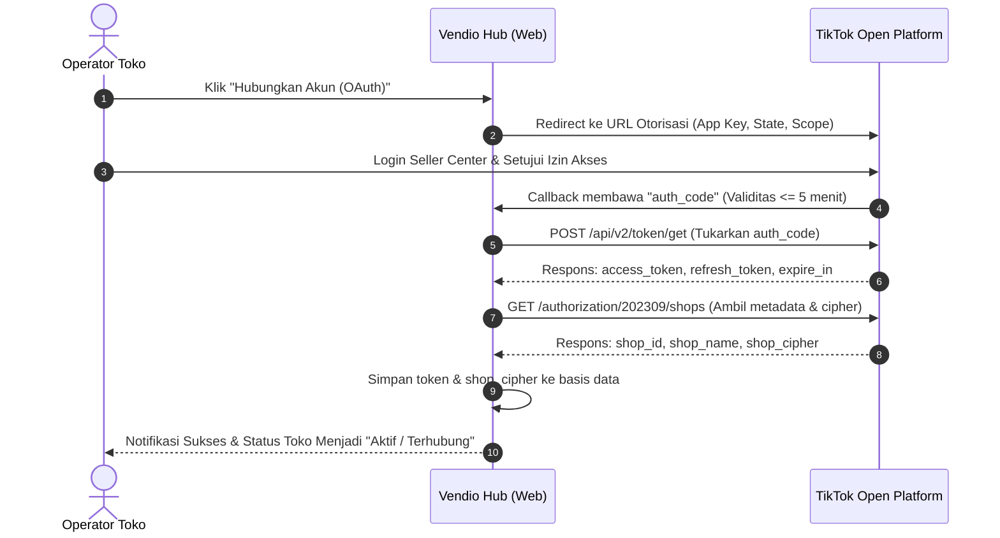
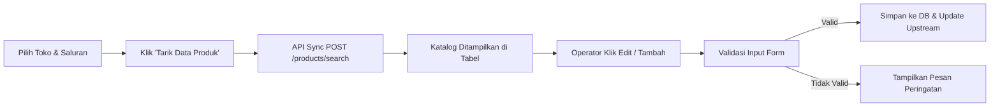
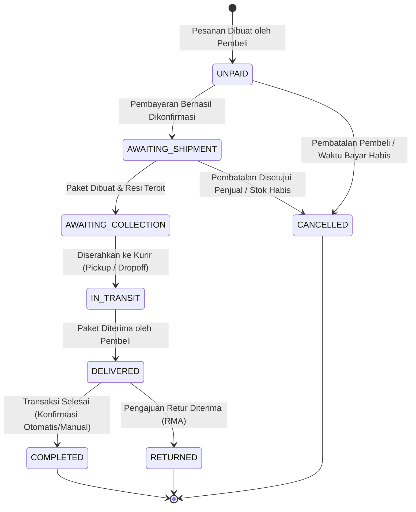
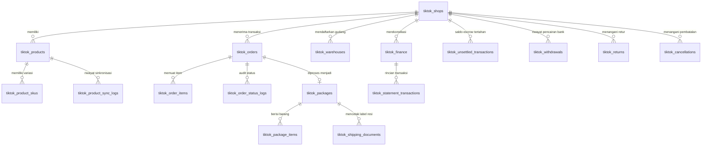
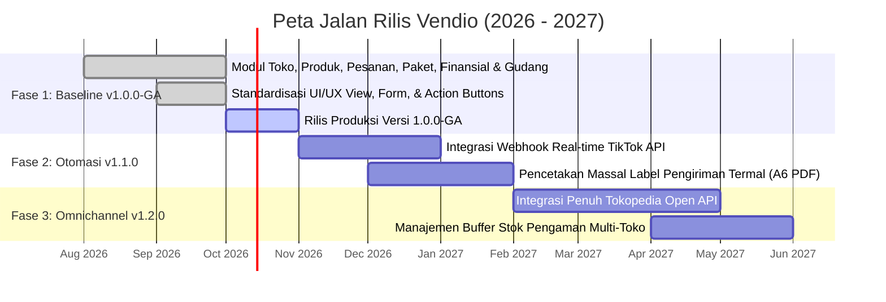

# Product Requirement Document (PRD)
# Sistem: Vendio — Hub Operasional Multi-Toko TikTok Shop & Tokopedia

| Atribut Dokumen | Spesifikasi |
| :--- | :--- |
| **ID Dokumen** | PRD-VND-2026-001-ID |
| **Versi Dokumen** | 1.0.0-GA (Dokumen Hidup / *Living Document*) |
| **Penyusun** | Technical Product Management & Lead Systems Architect |
| **Target Pembaca** | Tim Bisnis, Rekayasa Perangkat Lunak (FE/BE/QA), Operasional Toko, Gudang, & Keuangan |
| **Tanggal Pengesahan** | 29 September 2026 |
| **Target Integrasi** | TikTok Shop Partner Open API (Versi API `2023-09`) & Saluran Listing Tokopedia |
| **Status Dokumen** | Disetujui sebagai Baseline Pengembangan Resmi |

---

## 1. Definisi Produk & Tujuan (Product Purpose)

### 1.1 Apa Itu Vendio?
**Vendio** adalah platform hub operasional *e-commerce omnichannel* yang mengintegrasikan pengelolaan multi-toko (TikTok Shop dan Tokopedia) ke dalam satu sistem terpusat. Vendio mendeskripsikan **apa yang dibangun**, **mengapa sistem ini dibutuhkan**, serta **fitur-fitur apa saja yang disertakan** guna menyelaraskan ekspektasi seluruh pihak yang terlibat (manajemen bisnis, tim teknis, dan staf operasional).

### 1.2 Masalah yang Ingin Diselesaikan
Penjual daring (*merchants*) yang memiliki banyak cabang toko di TikTok Shop dan Tokopedia menghadapi hambatan operasional nyata:
1. **Isolasi Akun & Sesi Login:** Operator harus membuka banyak jendela penyamaran (*incognito*) atau berulang kali *login/logout* di Seller Center, menyebabkan respons pesanan lambat dan sering terjadi putus sesi (*session drop*).
2. **Keterlambatan Pemenuhan (*Fulfillment Delay*):** Pesanan berstatus `AWAITING_SHIPMENT` sering terlambat diproses atau salah kemas karena data tersebar, memicu risiko penalti *Late Dispatch Rate* (LDR) dari marketplace.
3. **Ketidaksinkronan Stok & Multisaluran:** Perubahan stok di satu platform tidak otomatis terdistribusi ke saluran lain, berakibat fatal pada penjualan barang kosong (*overselling*).
4. **Opasitas Rekonsiliasi Finansial:** Dana pembayaran pembeli ditahan oleh sistem *escrow*. Tim keuangan kesulitan merekonsiliasi antara omzet kotor, subsidi ongkir, biaya layanan marketplace, saldo tertahan (*unsettled*), dan dana yang sudah dicairkan ke rekening (*withdrawals*).

### 1.3 Sasaran & Dampak yang Diharapkan
- **Efisiensi Waktu Operasional:** Mengurangi waktu pemrosesan pesanan harian minimal **40%**.
- **Ketepatan Pemenuhan (100% Sesuai SLA):** Memastikan proses pembuatan paket dan nomor resi selesai dalam batas waktu $\le 48$ jam.
- **Transparansi Keuangan Real-Time:** Menghilangkan pencatatan manual berbasis spreadsheet melalui rekap otomatis *settlement* dan *escrow*.
- **Pemusatan Kontrol Logistik:** Memetakan seluruh gudang fisik (*sales & return warehouse*) lintas cabang toko dalam satu antarmuka.

---

## 2. Identifikasi Stakeholder & Target Pengguna

Dokumen ini disusun dengan melibatkan seluruh pihak yang berinteraksi langsung maupun terpengaruh oleh sistem Vendio:

| Kategori Stakeholder | Pihak yang Terlibat | Peran & Ekspektasi Terhadap Produk |
| :--- | :--- | :--- |
| **Pengguna Akhir (*End Users*)** | **Admin / Operator Toko** | Membutuhkan antarmuka yang cepat untuk filter multi-toko, cek pesanan, satu-klik salin Order ID, dan sinkronisasi katalog produk. |
| | **Staf Gudang (*Fulfillment*)** | Membutuhkan form kemasan paket ringkas, auto-fill alamat dan item barang dari nomor pesanan, serta kemudahan cetak label termal A6. |
| | **Staf Finansial (*Accounting*)** | Membutuhkan metrik arus kas harian yang jelas: omzet bersih (*settled*), dana tertahan (*unsettled*), potongan biaya platform, dan rekap penarikan bank. |
| **Tim Bisnis** | **Business Operations & GM** | Menuntut kepatuhan operasional toko terhadap SLA marketplace dan ketersediaan laporan pertumbuhan penjualan cabang. |
| **Tim Teknis** | **Software Engineers & QA** | Membutuhkan batasan fungsional yang jelas, kontrak API yang valid, arsitektur basis data relasional, dan kriteria pengujian terukur. |
| **Klien / Investor** | **Brand Owner & Merchant Partner** | Membutuhkan keandalan sistem multi-toko, keamanan kredensial toko, dan transparansi laporan bisnis. |

---

## 3. Deskripsi Fitur Utama, Prioritas & Alur Pengguna (User Flow)

Fitur diklasifikasikan menggunakan prioritas standar industri:
* **Must Have [P1]:** Fitur inti yang wajib ada agar sistem dapat beroperasi pada rilis v1.0.
* **Should Have [P2]:** Fitur penting yang meningkatkan efisiensi kerja operasional.
* **Nice to Have [P3]:** Fitur bernilai tambah untuk kenyamanan dan otomatisasi lanjutan.

---

### 3.1 Modul 01: Otorisasi Akun Toko & Manajemen Token (`tiktok_shops`)
* **Prioritas:** `Must Have [P1]`
* **Tujuan Fitur:** Menghubungkan akun TikTok Seller Center ke Vendio secara resmi dan aman menggunakan protokol OAuth 2.0.
* **Deskripsi:**
  - Registrasi akun toko dengan identifier: Nama Toko, ID Toko, Kode Wilayah/Region.
  - Alur otorisasi resmi: Tombol "Hubungkan Akun (OAuth)" mengarahkan operator ke portal izin TikTok Shop Open Platform.
  - Penyimpanan kredensial aman: `access_token`, `refresh_token`, dan `shop_cipher`.
  - Mekanisme penyegaran token otomatis berkala (24 jam) serta tombol manual "Perbarui Token" jika token mendekati masa kedaluwarsa.

#### Alur Pengguna (*User Flow* - Otorisasi Toko):

---

### 3.2 Modul 02: Manajemen Katalog & Multi-Saluran (`tiktok_products`)
* **Prioritas:** `Must Have [P1]`
* **Tujuan Fitur:** Memusatkan inventaris katalog, SKU, harga, dan multi-platform (TikTok & Tokopedia) dalam satu tabel terpadu.
* **Deskripsi:**
  - Pemilahan katalog menggunakan filter toko (*multi-shop selector*) dan platform penjualan (*TikTok / Tokopedia / Semua Saluran*).
  - Sinkronisasi massal (*batch sync*) produk dari Seller Center ke basis data lokal.
  - Form tambah/ubah produk dengan validasi ketat: Nama Produk, Kategori, Brand, Berat Paket (Kg), Dimensi (P x L x T), dan Deskripsi Produk (Rich Text).
  - Manajemen status tayang (*Live, Draft, Under Review, Suspended*).

#### Alur Pengguna (*User Flow* - Pengelolaan Produk):

---

### 3.3 Modul 03: Pemrosesan Pesanan (*Order Engine*) (`tiktok_orders`)
* **Prioritas:** `Must Have [P1]`
* **Tujuan Fitur:** Memonitor dan menyaring seluruh siklus hidup pesanan penjualan secara waktu nyata.
* **Deskripsi:**
  - **Sifat Data Hanya-Baca (*Read-Only Ingestion*):** Pesanan tidak dapat ditambah manual untuk mencegah pemalsuan transaksi; data murni ditarik via API.
  - **Tab Counter Horisontal:** Lencana angka dinamis pada tab status: `Semua`, `Belum Bayar`, `Perlu Dikirim`, `Dalam Pengiriman`, `Selesai`, dan `Dibatalkan`.
  - **Penyalin ID Pesanan Satu Klik (*One-Click Copy*):** Tombol aksi instan untuk menyalin Order ID ke clipboard komputer.
  - Detail pesanan lengkap: Rincian item barang, kurir, opsi pengiriman, alamat penerima, dan ringkasan pembayaran.

#### Siklus Hidup Pesanan (*Order State Machine*):

---

### 3.4 Modul 04: Pengemasan, Logistik & Cetak Resi (`tiktok_packages`)
* **Prioritas:** `Must Have [P1]`
* **Tujuan Fitur:** Menjembatani pesanan yang siap dikirim dengan alur penyerahan kurir dan pencetakan label resi termal A6.
* **Deskripsi:**
  - Pembuatan paket pengiriman dari pesanan berstatus `AWAITING_SHIPMENT`.
  - Auto-fill otomatis data pemesan, alamat, dan item barang dari nomor pesanan terkait.
  - Penetapan berat kemasan aktual dan input dimensi untuk perhitungan berat volumetrik:
    $$\text{Berat Volumetrik (Kg)} = \frac{\text{Panjang} \times \text{Lebar} \times \text{Tinggi}}{6000}$$
  - Pencetakan dokumen pengiriman resmi format A6 PDF (*thermal shipping label*) via API.
  - Konfirmasi serah terima paket (*handover dispatch*) dengan metode `PICKUP` atau `DROPOFF`.

---

### 3.5 Modul 05: Integrasi Gudang Penjualan & Retur (`tiktok_warehouses`)
* **Prioritas:** `Should Have [P2]`
* **Tujuan Fitur:** Memetakan titik fisik gudang untuk penjemputan barang pesanan keluar dan penerimaan paket retur barang.
* **Deskripsi:**
  - Penarikan resmi data gudang langsung dari TikTok Seller Center via API.
  - Pemisahan tipe gudang: `SALES_WAREHOUSE` (Gudang Penjualan) vs `RETURN_WAREHOUSE` (Gudang Retur).
  - Penandaan Gudang Utama (*Default Warehouse*) dan status aktif/nonaktif.
  - **Proteksi Akses:** Data gudang bersifat *Read-Only* di aplikasi untuk mencegah kegagalan rute kurir akibat input alamat manual yang tidak terdaftar di sistem pusat TikTok.

---

### 3.6 Modul 06: Rekonsiliasi Keuangan & Settlement (`tiktok_finance`)
* **Prioritas:** `Must Have [P1]`
* **Tujuan Fitur:** Memberikan transparansi arus kas transaksi, potongan komisi marketplace, saldo tertahan (*escrow*), dan pencairan dana rekening.
* **Deskripsi:**
  - **Kartu Ringkasan Finansial (*KPI Summary Cards*):** Menampilkan metrik utama:
    - Total Omzet Bersih (*Settled Revenue*)
    - Saldo Tertahan (*Unsettled Escrow Balance*)
    - Total Potongan Biaya Layanan Platform
    - Total Pencairan Dana Sukses (*Total Withdrawals*)
  - **Transaksi Belum Selesai (`tiktok_unsettled_transactions`):** Memonitor dana pesanan yang masih dalam masa penahanan garansi pembeli ($\approx 7$ hari).
  - **Riwayat Penarikan Saldo (`tiktok_withdrawals`):** Mencatat riwayat transfer saldo toko ke rekening bank perusahaan lengkap dengan status transfer.

#### Rumus Rekonsiliasi Transaksi Penjualan:
$$\text{Net Settlement} = \text{Nilai Pesanan} + \text{Subsidi Ongkir} - \text{Biaya Layanan Platform} - \text{Diskon Penjual}$$

---

### 3.7 Modul 07: Pembatalan & Retur Barang (*RMA*) (`tiktok_cancellations`, `tiktok_returns`)
* **Prioritas:** `Should Have [P2]`
* **Tujuan Fitur:** Mengontrol penanganan pesanan yang dibatalkan sepihak oleh pembeli dan memproses klaim retur barang fisik secara aman.
* **Deskripsi:**
  - Sinkronisasi data pengajuan pembatalan dengan opsi aksi: Setujui (*Approve*) atau Tolak (*Reject*). Penolakan wajib menyertakan kode alasan resmi dari tabel `tiktok_reject_reasons`.
  - Pelacakan resi balik barang retur menuju `RETURN_WAREHOUSE`.
  - Otorisasi pengembalian dana (*refund*) hanya dieksekusi setelah kondisi barang fisik diverifikasi oleh staf gudang.

---

### 3.8 Modul 08: Manajemen Hak Akses Pengguna (*RBAC*) (`user`, `aauth`)
* **Prioritas:** `Must Have [P1]`
* **Tujuan Fitur:** Mengisolasi wewenang operasional staf toko sesuai dengan peran jabatannya.

#### Matriks Peran & Hak Akses (*RBAC Matrix*):
| Aksi Operasional | Kode Izin (*Permission*) | Super Admin | Store Admin | Operator Gudang | Staf Finansial |
| :--- | :--- | :---: | :---: | :---: | :---: |
| Konfigurasi Toko & Kredensial API | `tiktok_shops_add` | Ya | Tidak | Tidak | Tidak |
| Perbarui Token Toko Manual | `tiktok_shops_update` | Ya | Ya | Tidak | Tidak |
| Ubah & Edit Katalog Produk | `tiktok_products_update`| Ya | Ya | Tidak | Tidak |
| Jalankan Tarik Data / Sinkronisasi | `tiktok_products_list` | Ya | Ya | Ya | Tidak |
| Lihat Daftar & Detail Pesanan | `tiktok_orders_view` | Ya | Ya | Ya | Ya |
| Konfirmasi & Kemas Paket | `tiktok_packages_update`| Ya | Ya | Ya | Tidak |
| Cetak Label Pengiriman Termal | `tiktok_packages_view` | Ya | Ya | Ya | Tidak |
| Akses Laporan Settlement & Finansial | `tiktok_finance_list` | Ya | Tidak | Tidak | Ya |
| Kelola Profil & Unggah Foto Avatar | `user_update_profile` | Ya | Ya | Ya | Ya |

---

## 4. Kriteria Penerimaan (Acceptance Criteria)

Kriteria keberhasilan untuk setiap fitur kritis menggunakan format terukur **Given - When - Then**:

### 4.1 AC-01: Otorisasi OAuth Toko & Penyimpanan Cipher
* **GIVEN:** Operator memiliki wewenang `tiktok_shops_add` dan berada di formulir tambah toko.
* **WHEN:** Operator memasukkan `auth_code` yang sah (berusia $< 5$ menit) dan menekan tombol simpan.
* **THEN:** Sistem menukarkan kode tersebut menjadi `access_token` dan `refresh_token`, memanggil API `/authorization/202309/shops`, mengekstrak string `shop_cipher`, menyimpan ke database, dan menampilkan status toko sebagai "Aktif / Terhubung".

### 4.2 AC-02: Validasi Formulir Katalog Produk
* **GIVEN:** Pengguna sedang mengedit rincian produk di antarmuka katalog.
* **WHEN:** Pengguna memasukkan berat paket `0.00 kg` atau mengisi deskripsi produk kurang dari 10 karakter.
* **THEN:** Sistem memblokir pengiriman formulir dan menampilkan pesan peringatan:
  - *"Berat paket minimal 0.01 kg"*
  - *"Deskripsi produk minimal 10 karakter sesuai ketentuan TikTok"*

### 4.3 AC-03: Penyalin ID Pesanan Satu Klik
* **GIVEN:** Operator melihat tabel pesanan pada tab "Perlu Dikirim".
* **WHEN:** Operator mengklik ikon salin di samping ID pesanan.
* **THEN:** String ID pesanan berhasil disalin ke clipboard sistem operasi dan muncul toast notifikasi hijau: *"ID Pesanan berhasil disalin!"* selama 2 detik tanpa memuat ulang halaman.

### 4.4 AC-04: Ketersediaan Cetak Label Pengiriman A6
* **GIVEN:** Paket pengiriman telah terbuat dan memiliki nomor resi kurir.
* **WHEN:** Staf gudang menekan tombol "Cetak Label Pengiriman".
* **THEN:** Sistem mengambil dokumen PDF dari API TikTok dan membuka jendela pratinjau dokumen dalam format standar A6 siap cetak ke printer termal.

### 4.5 AC-05: Isolasi Penyimpanan Berkas Profil Pengguna
* **GIVEN:** Pengguna mengunggah gambar profil baru di form Edit Profile.
* **WHEN:** Berkas berformat PNG/JPEG valid diunggah dan disimpan.
* **THEN:** Sistem memastikan folder `uploads/user/` dibuat otomatis jika belum ada di server, berkas dipindahkan secara aman (`@rename`), dan respons JSON sukses dikembalikan tanpa memicu pesan *PHP Warning*.

---

## 5. Asumsi dan Batasan (Assumptions & Constraints)

### 5.1 Asumsi Produk (*Assumptions*)
1. Penjual telah memiliki akun resmi TikTok Shop Seller Center yang telah disetujui (*approved*) dan aktif di wilayah operasional Indonesia.
2. Perangkat pengguna (laptop/tablet) memiliki koneksi internet stabil untuk berkomunikasi dengan server Vendio dan TikTok Open Platform API.
3. Lingkungan server hosting menggunakan PHP versi 7.2 hingga 8.x dengan ekstensi cURL, OpenSSL, PDO, dan GD aktif.
4. Standar mata uang seluruh transaksi keuangan dan pembukuan adalah **Rupiah (IDR)**.

### 5.2 Batasan Sistem (*Constraints*)
1. **Batas Panggilan API (*Rate Limiting*):** Kecepatan penarikan data massal dibatasi oleh kuota batas panggilan API per menit sesuai regulasi TikTok Open Platform.
2. **Pendaftaran Akun Toko Baru:** Vendio tidak menyediakan form pendaftaran entitas toko baru ke TikTok; proses registrasi awal toko tetap wajib dilakukan di portal resmi Seller Center.
3. **Alamat Fisik Gudang Bersifat Read-Only:** Pendaftaran atau pemindahan alamat fisik gudang hanya dapat dilakukan melalui TikTok Seller Center, kemudian disinkronkan ke Vendio.
4. **Cakupan Rilis Awal (v1.0):** Sistem difokuskan penuh pada aplikasi web responsif (desktop & tablet); aplikasi mobile native (Android/iOS) berada di luar ruang lingkup rilis v1.0.

---

## 6. Kamus Data & Relasi Entitas (ERD Visual)

Relasi 17 entitas basis data utama Vendio dimodelkan sebagai berikut:

---

## 7. Kebutuhan Non-Fungsional (Non-Functional Requirements)

| Dimensi Kebutuhan | Standar & Spesifikasi Teknis |
| :--- | :--- |
| **Keamanan Data** | Seluruh kredensial API (`app_secret`, `access_token`, `shop_cipher`) wajib tersimpan aman. Form input dilindungi dari ancaman CSRF, XSS, dan SQL Injection. |
| **Performa & Kecepatan** | Waktu muat halaman kueri tabel utama dengan pagination sisi server wajib merespons dalam waktu $\le 800\text{ ms}$ pada beban data hingga $50.000$ baris. |
| **Pencegahan Rate Limit API** | Penarikan data massal dipecah dalam kuota maksimal 50 item per kueri dengan jeda internal $150\text{ ms}$ agar tidak memicu galat HTTP 429 dari gateway TikTok. |
| **Konsistensi UI/UX** | Menerapkan palet warna terstandarisasi (aksen hijau `#00a65a`, tombol aksi berbingkai, badge status pill, dan tipografi modern yang nyaman dibaca). |
| **Pencatatan Audit (*Logging*)** | Setiap kegagalan transaksi dan respons API pihak ketiga dicatat otomatis ke log terisolasi (`application/logs/`) tanpa mengekspos error teknis mentah ke layar operator. |

---

## 8. Prinsip Pemeliharaan & Mitigasi Kesalahan PRD

Mengacu pada panduan penyusunan dokumen produk profesional, PRD ini disusun dengan menghindari kesalahan umum (*anti-patterns*):

1. **Fokus pada Kebutuhan Nyata (*Focus on Value*):**
   - Dokumen ini mendeskripsikan secara lugas *apa yang dibutuhkan oleh pengguna* (misal: bagaimana admin gudang mencetak label resi, bagaimana finance melihat saldo tertahan), bukan sekadar tumpukan instruksi kode internal.
2. **Validasi Berbasis Pengguna Akhir (*User-Centric Validation*):**
   - Setiap modul dirancang berdasarkan alur kerja nyata staf operasional (alur pengemasan, alur penolakan retur dengan alasan resmi, dan filter toko).
3. **Dokumen Hidup (*Living Document Principle*):**
   - PRD ini tidak bersifat statis sekali tulis. Setiap penambahan fitur, perubahan skema API, atau penyesuaian regulasi e-commerce wajib dicatat melalui nomor versi, tanggal rilis, dan tabel riwayat revisi dokumen.

---

## 9. Peta Jalan Produk (Roadmap Visual)

---

*Dokumen ini merupakan spesifikasi kebutuhan produk resmi Vendio. Segala perubahan kebutuhan di kemudian hari wajib dikomunikasikan dan disahkan melalui mekanisme evaluasi tinjauan teknis.*
